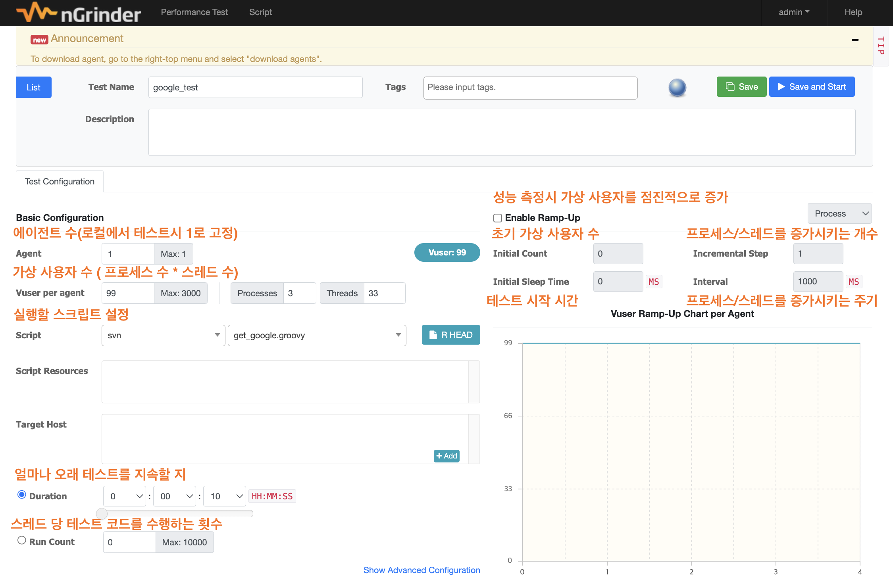
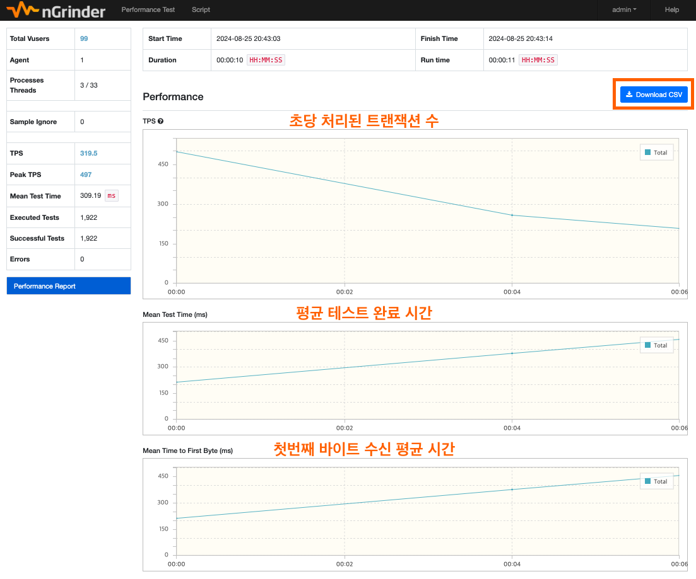

# nGrinder-practice


nGrinder를 이용한 부하테스트 예제로,
자세한 내용은 원본 [노션](https://leedongyeop.notion.site/APM-44e22aa997d54f80b736f5e4026c6498?pvs=4)에서 확인하실 수 있습니다.


<br/>

## nGrinder 소개

- 네이버에서 진행한 오픈 소스 프로젝트로 서버의 부하 테스트를 위한 도구
- 주요 기능
    - 스크립트 레코딩: 웹 브라우저에서 사용자 동작을 녹화하여 테스트 스크립트를 생성
    - 분산 테스트: 다수의 에이전트 머신을 사용하여 대규모 테스트를 수행
    - 실시간 모니터링: 테스트 진행 중에 성능 지표를 실시간으로 모니터링
    - 분석 및 리포팅: 테스트 결과를 다양한 그래프와 테이블로 분석하고, 리포트를 생성
- JMeter와 차이점
    - JMeter는 단일 데스크톱 컴퓨터에서 수행되는 반면, nGrinder 는 컨트롤러 및 에이전트로 구성된 분산 아키텍처로 수행된다.
    - nGrinder는 jython 또는 Groovy 같은 스크립트 언어를 사용하여 스크립트를 작성한다.
    - 도커, 클라우드 환경에서도 실행 가능하다.

<br/>

## nGrinder 주요 개념
### Controller
- 테스트를 생성하고, 실행하고, 테스트 결과를 수집하고 분석
- 단일 머신에 설치
### Agent
- 컨트롤러가 생성한 테스트를 수행하는 실행 환경
- 각 에이전트는 분산된 머신 또는 가상 머신에 설치
- 에이전트가 테스트에 필요한 부하를 생성하고, 데이터를 수집하여 컨트롤러에 전송

<br/>

## nGrinder 사용 방법

1. nginder 설치 ([버전 참고 링크](https://github.com/naver/ngrinder/releases))
    ```bash
    $ wget https://github.com/naver/ngrinder/releases/download/ngrinder-3.5.9-p1-20240613/ngrinder-controller-3.5.9-p1.war
    ```

2. nGrinder-controller Dockerfile 작성
- ngrinder는 현재(2024.08.25)까지 Java 8과 11까지만 지원하고 있다.
- 따라서, Java 11 환경에서 실행하기 위해 아래와 같이 Docker 환경을 구성
    ```
    # ngrinder-controller-3.5.9-p1.war 파일이 존재하는 디렉토리에 작성
    FROM openjdk:11-slim

    ARG WAR_FILE=./*war
    COPY ${WAR_FILE} app.war

    ENTRYPOINT ["java", "-jar", "/app.war"]
    ```

3. Agent 압축 해지
    ```bash
    $ tar -xvf ngrinder-agent-3.5.9-p1-localhost.tar
    ```

4. nGrinder-agent Dockerfile 작성
    ```
    # run_agent.sh 이 존재하는 디렉토리에 작성
    FROM openjdk:11-slim
    COPY / /home/

    CMD /home/run_agent.sh -ch ngrinder-controller-arm
    ```

5. docker-compose.yml 작성
    ```yaml
    version: "3.8"
    services:
    ngrinder-controller:
        container_name: ngrinder-controller-arm

        build:
        context: ./ngrinder-controller
        dockerfile: Dockerfile
        restart: always

        ports:
        - "8080:8080"     # nGrinder UI 포트
        - "12000-12100:12000-12100"  # nGrinder Agents 포트(에이전트 개수만큼 12000+@)
        - "16001:16001"   # nGrinder Controller 포트
        networks:
        - ngrinder

    #    volumes:
    #      - ./ngrinder-controller:/home/  # 컨테이너의 /home/과 호스트의 해당 디렉토리를 연결

    ngrinder-agent:
        container_name: ngrinder-agent-arm
        depends_on:
        - ngrinder-controller
        build:
        context: ./ngrinder-agent
        dockerfile: Dockerfile
        restart: always
    #    volumes:
    #      - ./ngrinder-agent:/home/  # 컨테이너의 /home/과 호스트의 해당 디렉토리를 연결

        networks:
        - ngrinder

    networks:
    ngrinder:
        driver: bridge
    ```

<br/>

## 실행 결과

